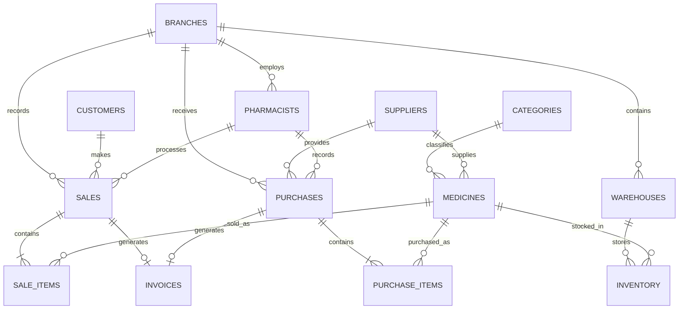

<p align="center">
  
</p>

<h1 align="center">Noor AlHuda Pharmacy Management System</h1>

<p align="center">
  A full desktop pharmacy management system built with JavaFX, MySQL, and JDBC.
</p>

<p align="center">
  
  
  
  
  
</p>

---

## Overview

**Noor AlHuda Pharmacy Management System** is a database-driven JavaFX desktop application designed to support the daily operations of a multi-branch pharmacy.

The system centralizes medicine, customer, supplier, warehouse, inventory, sales, purchase, invoice, and reporting data in a normalized MySQL database. It provides a professional graphical interface for managing records, executing transactional workflows, monitoring stock, and generating analytical reports.

The application was developed as a complete COMP333 database project and includes:

- A JavaFX desktop application
- A MySQL relational database normalized to Third Normal Form (3NF)
- JDBC database connectivity
- Transaction-safe sales and purchase workflows
- Inventory synchronization
- Automatic invoice creation
- Twenty required analytical reports
- Five supplementary reports
- ER and relational schema diagrams
- Demo data for testing the complete system

---

## Key Features

### Authentication and Dashboard

- Manager login screen
- Live database connection indicator
- Default demonstration credentials
- Full-screen responsive application window
- Dashboard summary cards for:
  - Total medicines
  - Total customers
  - Total sales
  - Low-stock records
- Pharmacy branding and module overview

### Medicine Management

- Add medicines
- Update medicine information
- Search by medicine, category, supplier, description, or status
- Select categories and suppliers through database-backed dropdowns
- Track selling price and expiration date
- Activate or deactivate medicines
- Display expired, active, inactive, and low-stock statistics
- Card-based record presentation

### Customer Management

- Add, update, search, and delete customers
- Store names, phone numbers, addresses, email addresses, gender, and birth date
- Prevent deletion when a customer is referenced by sales
- Card-based record presentation

### Supplier Management

- Add, update, search, and delete suppliers
- Store supplier, contact-person, company, phone, address, and email information
- Prevent deletion when a supplier is referenced by medicines or purchases
- Card-based record presentation

### Warehouse Management

- Add, update, search, and delete warehouses
- Associate every warehouse with a branch
- Store warehouse location and capacity
- Prevent deletion when a warehouse is used by inventory records
- Card-based record presentation

### Inventory and Stock Management

- Manage the many-to-many relationship between warehouses and medicines
- Add, update, search, and delete stock records
- Track:
  - Quantity
  - Reorder level
  - Availability status
  - Last-updated timestamp
- Automatically calculate inventory status:
  - `AVAILABLE`
  - `LOW_STOCK`
  - `OUT_OF_STOCK`
  - `EXPIRED`
- Display total units, low-stock items, and out-of-stock items
- Use database-backed medicine and warehouse dropdowns

### Sales Management

- Create a sale for a selected customer, pharmacist, branch, warehouse, medicine, and quantity
- Support multiple payment methods:
  - Cash
  - Card
  - Insurance
  - Mobile payment
  - Other
- Validate available stock before completing a sale
- Read the medicine price directly from the database
- Calculate the sale total automatically
- Create the sale and sale-item records
- Deduct sold quantity from inventory
- Recalculate inventory status
- Generate a linked sales invoice automatically
- Update payment method and transaction status
- Cancel sales without physically deleting transaction history
- Search sales by customer, pharmacist, branch, payment method, or status

### Purchase Management

- Create purchases from a selected supplier
- Record pharmacist, branch, warehouse, medicine, quantity, and cost price
- Calculate total purchase cost automatically
- Create purchase and purchase-item records
- Increase existing stock or create a new inventory record
- Recalculate inventory status
- Generate a linked purchase invoice automatically
- Update or cancel purchase transactions
- Search purchases by supplier, pharmacist, branch, or status

### Invoices

Invoices are implemented as financial records linked directly to either a sale or a purchase.

- `SALE` and `PURCHASE` invoice types
- One optional unique `sale_id`
- One optional unique `purchase_id`
- Invoice status synchronization with sales and purchases
- No duplicate invoice-item table
- Transaction item details remain in `sale_items` and `purchase_items`

### Reports and Statistics

The application includes **25 report screens**:

- 20 required analytical SQL reports
- 5 supplementary reports
- Dynamic result tables generated from `ResultSetMetaData`
- Bar-chart visualization
- Date-range inputs where required
- Supplier selection where required
- Summary cards for revenue, purchase cost, and inventory value

---

## Transaction Safety

Sales and purchases use explicit database transactions.

### Sale Transaction

```text
Lock inventory record
        |
Validate available quantity
        |
Insert sale
        |
Insert sale item
        |
Decrease inventory quantity
        |
Update inventory status
        |
Create sales invoice
        |
Commit
```

If any step fails, the complete transaction is rolled back.

### Purchase Transaction

```text
Insert purchase
        |
Insert purchase item
        |
Lock inventory record
        |
Increase stock or create inventory record
        |
Update inventory status
        |
Create purchase invoice
        |
Commit
```

If any step fails, the complete transaction is rolled back.

The application also uses Java `try-with-resources` to close connections, statements, and result sets automatically.

---

## Technology Stack

| Layer | Technology |
|---|---|
| Programming language | Java 21 |
| Desktop UI | JavaFX 23 |
| Database | MySQL 8.x |
| Database API | JDBC |
| Database driver | MySQL Connector/J |
| IDE | Eclipse IDE |
| Data model | Relational database in 3NF |
| Storage engine | InnoDB |
| Character set | `utf8mb4` |

The user interface is created programmatically in JavaFX and does not require FXML.

---

## System Architecture

```text
JavaFX User Interface
        |
        v
PharmacyFX.java
  - Forms and validation
  - CRUD operations
  - Transaction workflows
  - Reports and charts
        |
        v
DBConnection.java
        |
        v
JDBC / MySQL Connector-J
        |
        v
pharmacy_system_db
```

---

## Database Design

The database contains **13 tables**.

| Table | Purpose |
|---|---|
| `branches` | Pharmacy branches and operational status |
| `categories` | Medicine classifications |
| `suppliers` | Medicine suppliers and contact details |
| `customers` | Pharmacy customer information |
| `pharmacists` | Employees linked to branches |
| `warehouses` | Storage locations linked to branches |
| `medicines` | Medicine catalog, prices, expiration, category, and supplier |
| `inventory` | Stock by warehouse and medicine |
| `sales` | Customer sale transactions |
| `sale_items` | Medicines included in sales |
| `purchases` | Supplier purchase transactions |
| `purchase_items` | Medicines included in purchases |
| `invoices` | Financial records linked to sales or purchases |

### Important Design Decisions

- The database is normalized to **3NF**.
- `payment_method` is stored as an attribute of `sales`.
- Invoices link directly to either a sale or a purchase.
- `inventory` uses a composite primary key:
  - `warehouse_id`
  - `medicine_id`
- `sale_items` and `purchase_items` use composite primary keys.
- Line totals are generated automatically by MySQL.
- Foreign keys enforce referential integrity.
- `CHECK`, `UNIQUE`, and `ENUM` constraints protect data quality.
- Search and reporting columns are indexed.
- InnoDB provides foreign-key and transaction support.

---

## Database Diagrams

The final implemented design is defined by the SQL schema and the 3NF relational schema.



### Relational Schema

The final schema documents the implemented 3NF database:

[Open the final relational schema PDF](diagrams/Relational_Schema_NoorAlHuda.pdf)

### Conceptual ER Diagram

The submitted conceptual ER diagram is available here:

[Open the ER diagram](diagrams/ER.jpeg)

> The SQL schema and relational schema are the source of truth for the implemented design.  
> In the final implementation, `payment_method` is an attribute of `sales`, and each invoice links directly to either one sale or one purchase.

---

## Analytical Reports

<details>
<summary><strong>View the 20 required reports</strong></summary>

1. All medicines with category, supplier, selling price, and expiration date
2. Expired medicines and medicines expiring within 30 days
3. Medicines below their total reorder level
4. Total available quantity per medicine
5. Medicine quantity per warehouse
6. Warehouse with the highest total stock
7. Medicines supplied by a selected supplier
8. Supplier medicine counts
9. Sales within a selected date range
10. Sales with medicine-level details
11. Daily sales totals within a period
12. Profit within a selected date range
13. Top five most-sold medicines
14. Least-sold medicines
15. Customers ranked by total spending
16. Sales count by pharmacist within a period
17. Purchases from a selected supplier within a period
18. Total purchase cost by supplier
19. Most-used payment method
20. Categories ranked by sales revenue

</details>

<details>
<summary><strong>View the supplementary reports</strong></summary>

1. Purchases between dates
2. Sales by branch
3. Inventory value by warehouse
4. Payment-method statistics
5. Expired medicines by category

</details>

The standalone SQL report file is available at:

[`database/Pharmacy_20_Reports_SQL_FIXED_5_7_10(1).sql`](database/Pharmacy_20_Reports_SQL_FIXED_5_7_10(1).sql)

Some queries use `?` placeholders because they are executed as parameterized `PreparedStatement` queries by the Java application.

---

## Demo Data

The supplied demo script populates the complete schema with connected sample data:

| Data | Seeded records |
|---|---:|
| Branches | 4 |
| Categories | 10 |
| Suppliers | 7 |
| Customers | 10 |
| Pharmacists | 6 |
| Warehouses | 6 |
| Medicines | 24 |
| Inventory records | 31 |
| Purchases | 8 |
| Purchase items | 17 |
| Sales | 12 |
| Sale items | 31 |
| Invoices | 20 |

---

## Project Structure

```text
1230571_1230096_COMP333_PhaseFinal/
|
|-- database/
|   |-- pharmacy_full_setup_create_and_data.sql
|   |-- pharmacy_create_tables .sql
|   |-- pharmacy_demo_data.sql
|   `-- Pharmacy_20_Reports_SQL_FIXED_5_7_10(1).sql
|
|-- diagrams/
|   |-- ER.jpeg
|   `-- Relational_Schema_NoorAlHuda.pdf
|
|-- report/
|   `-- 1230571_1230096_COMP333_Phase3  .pdf
|
|-- src/
|   |-- PharmacyFX.java
|   |-- DBConnection.java
|   |-- logo.png
|   |-- logo1.png
|   `-- logo2.png
|
|-- README.md
`-- README.txt
```

---

## Prerequisites

Install the following:

- Java Development Kit 21 or later
- JavaFX SDK 23 or a compatible version
- MySQL Server 8.x
- MySQL Workbench
- MySQL Connector/J
- Eclipse IDE or another Java IDE

---

## Quick Start

### 1. Clone the Repository

```bash
git clone https://github.com/YOUR_USERNAME/Noor-AlHuda-Pharmacy-Management-System.git
cd Noor-AlHuda-Pharmacy-Management-System
```

### 2. Create and Seed the Database

Open MySQL Workbench and run:

```text
database/pharmacy_full_setup_create_and_data.sql
```

> **Warning:** This script starts with `DROP DATABASE IF EXISTS pharmacy_system_db`.  
> Running it removes the existing database and recreates it with demo data.

The script:

1. Creates `pharmacy_system_db`
2. Creates all 13 tables
3. Adds constraints and indexes
4. Inserts connected demo data
5. Resets auto-increment values
6. Runs verification queries

Do not repeatedly run the setup script after entering important data.

### 3. Configure Database Credentials

Open:

```text
src/DBConnection.java
```

Update the local MySQL credentials:

```java
private static final String URL =
        "jdbc:mysql://localhost:3306/pharmacy_system_db"
        + "?useSSL=false"
        + "&serverTimezone=UTC"
        + "&allowPublicKeyRetrieval=true";

private static final String USER = "root";
private static final String PASSWORD = "YOUR_MYSQL_PASSWORD";
```

### 4. Add MySQL Connector/J in Eclipse

```text
Right-click the project
-> Build Path
-> Configure Build Path
-> Libraries
-> Classpath
-> Add External JARs
```

Select the MySQL Connector/J `.jar` file.

### 5. Add JavaFX Libraries

Add all `.jar` files from the JavaFX SDK `lib` directory to the project.

Example:

```text
C:\path\to\javafx-sdk-23.0.1\lib
```

### 6. Configure JavaFX VM Arguments

In Eclipse:

```text
Run
-> Run Configurations
-> Java Application
-> PharmacyFX
-> Arguments
```

Add:

```text
--module-path "C:\path\to\javafx-sdk-23.0.1\lib" --add-modules javafx.controls,javafx.fxml
```

Click **Apply**, then **Run**.

### 7. Run the Application

Run:

```text
src/PharmacyFX.java
```

Default demo login:

```text
Username: admin
Password: admin
```

---

## Usage Guide

1. Start MySQL Server.
2. Run the database setup script once.
3. Configure `DBConnection.java`.
4. Run `PharmacyFX.java`.
5. Confirm that the login page displays **Database Connected**.
6. Log in using the demo credentials.
7. Use the sidebar to open the required module.
8. Select record cards before updating, deleting, or cancelling.
9. Use dropdowns to select related records safely.
10. Open **Reports / Statistics** to execute analytical reports.

---

## Resource Management

Database resources are closed safely:

- `Connection`
- `PreparedStatement`
- `Statement`
- `ResultSet`

Most operations use `try-with-resources`.

Sales and purchase workflows use explicit `commit`, `rollback`, and connection closing in `finally` blocks.

---

## Security Notes

This repository is an academic desktop application and uses demonstration authentication.

Before publishing or deploying it:

- Do not commit a real MySQL password.
- Replace the hard-coded password in `DBConnection.java`.
- Prefer environment variables or a local configuration file.
- Add the local credentials file to `.gitignore`.
- Replace `admin / admin` with database-backed authentication.
- Store passwords using a secure password-hashing algorithm.
- Create a limited MySQL application user instead of using `root`.

Example environment-variable approach:

```java
private static final String USER =
        System.getenv().getOrDefault("PHARMACY_DB_USER", "root");

private static final String PASSWORD =
        System.getenv("PHARMACY_DB_PASSWORD");
```

---

## Common Problems

### Database Not Connected

Check that:

- MySQL Server is running.
- `pharmacy_system_db` exists.
- The username and password are correct.
- MySQL Connector/J is on the classpath.

### JavaFX Runtime Components Are Missing

Confirm the VM arguments:

```text
--module-path "C:\path\to\javafx-sdk\lib" --add-modules javafx.controls,javafx.fxml
```

### Images Are Not Displayed

Keep these files inside `src/`:

```text
logo.png
logo1.png
logo2.png
```

The application loads them as classpath resources.

### Foreign-Key Error

Use existing values from the application dropdowns. Related categories, suppliers, branches, pharmacists, medicines, and warehouses must exist first.

### Raw Report Query Contains `?`

The `?` values are placeholders used by Java `PreparedStatement`. Run the report through the application or replace the placeholders manually when testing in MySQL Workbench.

---

## Documentation

- [ER diagram](diagrams/ER.jpeg)
- [3NF relational schema](diagrams/Relational_Schema_NoorAlHuda.pdf)
- [Standalone report queries](database/Pharmacy_20_Reports_SQL_FIXED_5_7_10(1).sql)

---

## Project Team

- **Khaled Bani Oudeh** 

---

## License

No open-source license has been added. All rights are reserved by the project authors.
